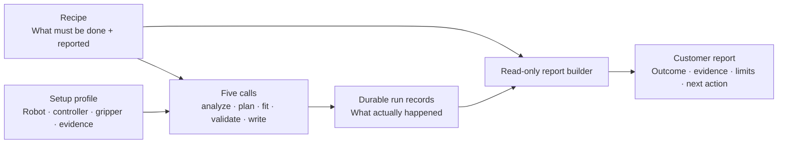
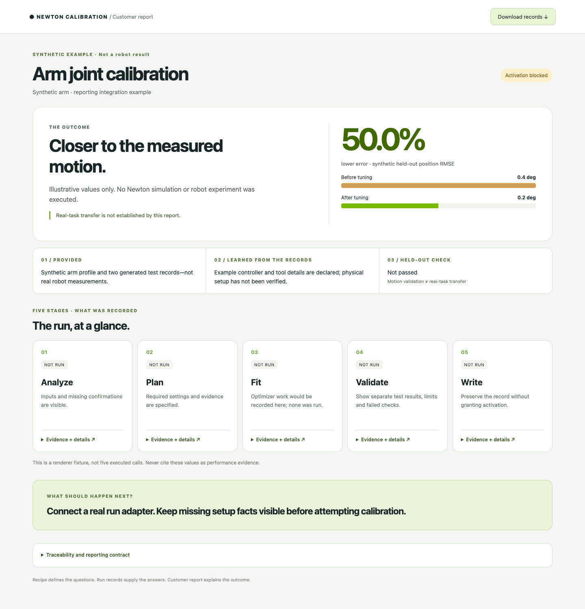

# Newton Calibration

**Real evidence → repeatable calibration → a result you can inspect.**

Calibrate a supported robot's simulated joint response using Isaac Lab and
Newton. Keep the inputs, settings, search and held-out checks together—and
explain the outcome in a customer report, not a printed configuration file.

**Current product slice: MVP1, free-space arm / unloaded-gripper response.**
Better trajectory agreement is not proof of grasp, insertion or real-task
transfer. Experimental extensions are not part of this deliverable.

## Start here

Start the guided terminal experience with `newton-calibration guide`, or connect
your agent to the same [guided API](docs/guided_workflow.md). Pick **Arm joint
tuning**, supply what you have, and leave unknowns unresolved. The guide inspects
the inputs and asks for what is missing. Grasp and insertion are listed as
planned, not executable recipes.

| I want to… | Read / run |
|---|---|
| Start with a robot and a goal, with or without real data | [Guided workflow](docs/guided_workflow.md) |
| Try the entire guided journey without a robot/GPU | `python examples/guided/demo.py --output output/guided-demo` (synthetic) |
| Understand the product and the five calls | [Toolkit integration guide](docs/toolkit_guide.md) |
| Understand what an arm calibration recipe contains | [Reusable arm recipe](src/newton_calibration/recipes/arm_joint_response.v1.json) |
| Build a customer report from recorded results | [Reporting developer guide](docs/recipe_reporting.md) |
| Try reporting without a GPU or robot data | [Synthetic example](examples/reporting/demo.py) · quick start below |
| Connect my own run format | [Adapter contract](docs/recipe_reporting.md#connect-a-new-producer) |
| Use a calibrated package / add an optimizer | [Package loader](docs/package_loader.md) · [Optimizer plug-ins](docs/optimizer_plugins.md) |

## One workflow. Three distinct records.



The **recipe** defines inputs, parameter families, collection needs and reporting
requirements. The **setup profile** supplies this customer's controller, tool,
mapping and limits. The **run records** supply actual results. Missing results
remain “not recorded”; they are never filled in from the recipe's expectations.

An optional agent uses the same five APIs to guide and monitor the work. It does
not own physics, invent confirmations, or replace the package verification gate.
The guide adds durable intake and collection states around those calls; it does
not replace them with a second fitting script. **Analysis completed** and
**ready to fit** are separate decisions.

## A report customers can read



The default view shows **the outcome, inputs, five stage cards and next action**.
Open a card for the loss, optimizer, parameters, evidence gaps and source records.
Measured/simulated trace GIFs can be attached to real reports; every media item is
classified and hash-checked. No raw configuration dump in the main view.

The preview above is **synthetic**, for UI and integration testing only. The
repository does not publish customer recordings or hardware photos.

### Try the report locally

```bash
python -m pip install -e '.[dev]'
python examples/reporting/demo.py --output output/report-demo
# Open output/report-demo/report.html in a browser.

# Re-render the same saved records. --strict flags missing required facts.
python -m newton_calibration.reporting \
  --recipe src/newton_calibration/recipes/arm_joint_response.v1.json \
  --bundle output/report-demo/bundle.json \
  --output output/report-demo/report.html --strict

pytest tests/test_reporting.py
```

Use a new output directory for each new snapshot; old runs are never silently
overwritten. Reporting needs no GPU and does not run a simulator or a robot.

## What the arm recipe asks for

| Area | Required information / evidence |
|---|---|
| Robot | USD, joint mapping, units/sign/zero, mounting and limits |
| Controller | Real and simulated modes, command meaning/rate, gains, filtering, compensation and provenance |
| Gripper / tool | Attached configuration, transform, mass/COM/inertia and held payload—or an explicit unknown |
| Motion evidence | Sent commands and q/dq, timestamps/clock semantics, independent train/held-out recordings |
| Collection | Reuse sufficient evidence; otherwise propose settling, sweeps, reversals or acceleration tests for supported parameters |
| Report | What changed, objective/optimizer, actual work, held-out result, uncertainty, output scope and next action |

Not every parameter is identifiable from every recording. A motion proposal is
not hardware permission, and a simulation preview is not a safety certificate.
The declarative recipe describes the procedure; the existing Python recipe and
installed adapters still determine which controllers and experiments can execute.

## Implementation status

- **Available:** five-call toolkit, evidence/runtime/optimizer boundaries,
  held-out validation, scoped package loader, read-only recipe-driven reporting,
  a five-call record adapter and an explicitly experimental Flexiv replay importer;
  guided recipe selection, setup/evidence intake, collection planning, resumable
  execution and a customer report sourced from the actual run records.
- **Collection:** exact command files and a default preview request. A running,
  compatible Isaac Lab/Newton scene adapter is required to render the video and
  perform dynamics-based experiment design. Missing adapters remain visible.
- **Not claimed:** unrestricted “any USD,” automatic confirmation of hardware
  settings, calibrated Cartesian/OSC control, real insertion transfer, or
  Minjae's proprietary agent implementation bundled in this repository.

See the [full integration guide](docs/toolkit_guide.md) for supported robot
boundaries, the SO-101 reference, Docker/Horde setup and the recorded scope of
earlier experiments. [Learn how to extend recipes and reports →](docs/recipe_reporting.md)
